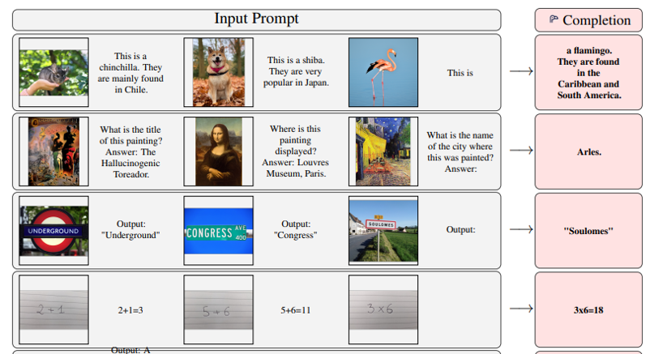

# vlm

I will blog about updates and considerations to the design of this repo here:
https://medium.com/@ammpersonal77

Learning language models, causal LM, and language model fine tuning.

Just for fun, let's also do MULTIMODAL language models, since we love a challenge!

Multimodal VLM for now:
- Use a ViT image encoder
-- I want to experiment with Segment Anything Model, other work from LLNL ongoing research on optimal image encodings for different Vision-language models. Depending on downstream task
- Use a image-caption pair dataset. Experiment with 'augmentation' / bootstrapping, for example image-text, text-image, text-image-text (all bootstrapped from same image-text sample)
-- In the LLaMA literature this is cited as prefix-content-suffix frmo another publication

- Experiment with new position encodings, combinations of sequence encoding and image encoding. Should an image inside a text block get a position encoding as well as an image (xy?) position embedding summed?

