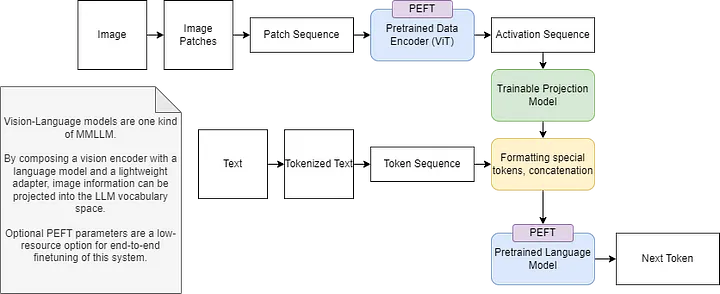

# Multimodal LLMs from Scratch

I will blog about updates and considerations to the design of this repo here:
https://medium.com/@ammpersonal77

Multimodal LLMs are an exciting new direction for multimodal AI research. Multimodality for LLMs come from utilizing a pretrained LLM in conjunction with a pretrained domain encoder (for example, an image encoder). A new untrained adapter module translates from the image encoder embedding space to the LLM token language embedding space. This system is trained end-to-end for the "domain tokenizer" / "adapter" component to succesfully translate between the data domain and language space to give the LLM multimodal understanding with no need to fine tune the extremely heavyweight LLM backbone. We also add PEFT components and experiment with adapter design, training schema, and eventually end-to-end multimodality - read the blog for more.

Multimodal VLM for now:
- Use a ViT image encoder
-- I want to experiment with Segment Anything Model, other work from LLNL ongoing research on optimal image encodings for different Vision-language models. Depending on downstream task
- Use a image-caption pair dataset. Experiment with 'augmentation' / bootstrapping, for example image-text, text-image, text-image-text (all bootstrapped from same image-text sample)
-- In the LLaMA literature this is cited as prefix-content-suffix frmo another publication

- Experiment with new position encodings, combinations of sequence encoding and image encoding. Should an image inside a text block get a position encoding as well as an image (xy?) position embedding summed?

- notes:
- - two way attention image and text? this assumes structured input, though?
  -   i think losing interwoven text and image would be fine, in order to use two-way attention as an adapter
  -     rather than as an llm replacement - though this would work im sure.
  -      maybe an alternate multimodal approach is just two-way attention over image and text. consider!
  - Qformer (blip) https://huggingface.co/docs/transformers/main/en/model_doc/blip-2#transformers.Blip2QFormerModel
  -   just look into this as an adapter model - again not sure about requirement for structured input

*The [Flamingo](https://arxiv.org/abs/2204.14198) Authors motivate the usage of multimodal (interwoven vision and text) language models as few-shot inference models. Imagine training a seperate model for each of these tasks!* :fearful:

*Here we share a general approach to multimodal langauge models with text output. Special tokens are added to the language model tokenizer, and end-to-end finetuning adapts the "image tokenizer" module to translate visual information for the language model.*
